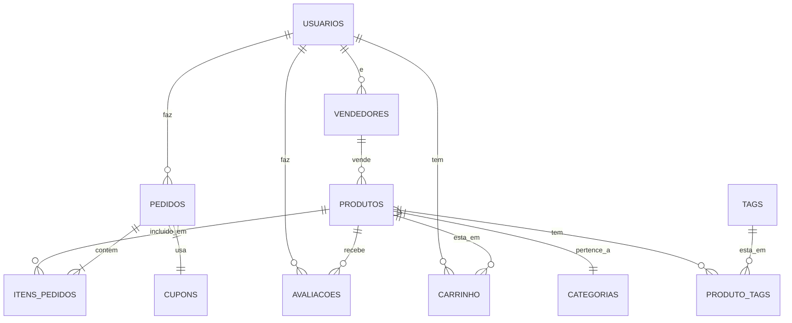

# 📦 E-commerce de Hardware

## 👥 Equipe de Desenvolvimento

- **Kairo** - Back-end/DB
- **Luis** - Front-end/UI
- **Leonardo** - Full-stack
- **Pietro** - DevOps/QA
- **Wendel** - Product Owner

## 🚀 Visão do Projeto

Plataforma de e-commerce especializada em peças de hardware, oferecendo:

- Catálogo de produtos
- Carrinho de compras
- Sistema de pedidos
- Cupons de desconto

## 🛠 Tecnologias Principais

### Backend

- Node.js (v18+)
- Express
- Prisma ORM
- MySQL

### Frontend

- React (v18)
- Tailwind CSS
- React Query

## 📂 Estrutura do Projeto

```
/backend
  ├── prisma/
  │   └── schema.prisma    # Modelos do banco
  ├── src/
  │   ├── controllers/     # Lógica das rotas
  │   ├── routes/          # Definição de endpoints
  │   └── utils/           # Helpers e configurações
/frontend
  ├── public/
  ├── src/
  │   ├── components/      # Componentes reutilizáveis
  │   ├── pages/           # Páginas da aplicação
  │   └── services/        # Conexão com API
```

## 🔧 Configuração

### Variáveis de ambiente:

```bash
cp .env.example .env
```

### Instalação:

```bash
# Backend
cd backend && npm install
npx prisma migrate dev

# Frontend
cd ../frontend && npm install
```

## 🏃 Execução

```bash
# Backend (em /backend)
npm run dev

# Frontend (em /frontend)
npm start
```

## 🌐 Endpoints Principais

| Método | Endpoint            | Descrição               |
| ------ | ------------------- | ----------------------- |
| GET    | /api/produtos       | Lista todos os produtos |
| POST   | /api/pedidos        | Cria novo pedido        |
| GET    | /api/cupons/:codigo | Valida cupom            |

## 🤝 Contribuição

1. Crie um branch:
   ```bash
   git checkout -b feature/nova-funcionalidade
   ```
2. Commit suas mudanças:
   ```bash
   git commit -m 'Adiciona X'
   ```
3. Push para o branch:
   ```bash
   git push origin feature/nova-funcionalidade
   ```
4. Abra um Pull Request

## 📊 Banco de Dados

### Diagrama simplificado:


